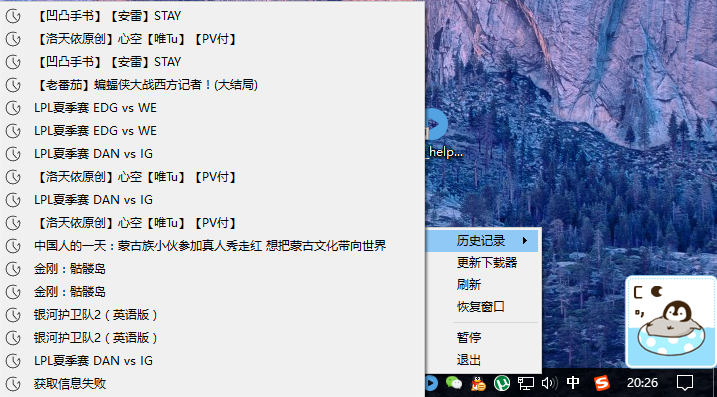

# 简易的python视频助手

- 简书 - http://www.jianshu.com/p/a44172ddccb9
- 代码中学习他人的地方大多留有参考链接，从最简单版逐渐拓展
- 感谢[myth](https://www.v2ex.com/member/myth)

### 效果

### 工具
- python3.5 + pyqt4 + pyinstaller
- you-get + mpv + youtube-dl

### 功能
- B站视频搜索、播放、下载
- 熊猫、斗鱼直播视频播放（视you-get更新情况而定）
- 播放历史记录(点击再次播放)
- 剪贴板侦听(来自[myth](https://github.com/xmyth/you_get_play/blob/master/you_get_play.py))

### 待完善
- 代码质量，目前只顾完成需求，代码有待优化
- 增加对已有内容，如熊猫、斗鱼等直播条目的搜索
- 增加对其它视频资源站的搜索
- 增加单独下载栏？
- 对于侦听到的单个视频链接和批量视频链接的复制做好下载机制的响应
- 增加下载文件地址选择
- 下载好的文件直接打开的机制
> 欢迎大家一起来玩

### 文件
- \*.png 与 \*.ico文件 为图片资源
- \*\_exp.py 为qt小组件实验
- \*\_v0 - \*\_v5 为需求拓展过程

### 打包
- `pyinstaller play_helper.py -F -w --i play.ico`